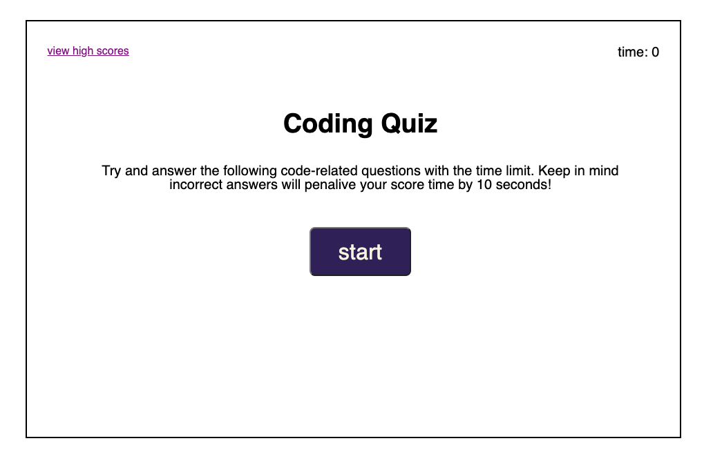

# coding quiz

This quiz app web link: https://xiaojing168jmg168.github.io/quiz-app/

Description:

This quiz app was created for a timer-based coding assessment.
This application has a few multiple-choice questions and the 
ability to store scores on the user's device.
When the user clicks the Start button, the question page will append
to the main content and the timer will being to count down.
When the user selects an answer, the page will change to the next question along with a message notifying the user the results of the previous question.
If the answer is correct, the countdown timer will reduce by 1 second;
If the answer is wrong, the countdown timer will reduce by 10 seconds;
The final score is based on the amount time remaining.
If the user answers all question or the timer reaches 0, the page goes to the
"All Done" page. And user can see their score and will need to enter their
initials. After submitting their initials, the page goes to the High Scores page
that stores different users' scores.
Users can also navigate to the High Scores page by clicking the "view high score" link in the upper-left corner of the Start Page;
The High Scores page has two buttons: One is the "go back" button which leads back to the home page. The other is the "clear high score" button that clears all high score data.

